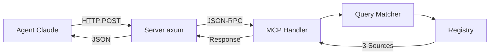

# Phase 7: Documentation & Testing - Research

**Researched:** 2026-02-03
**Domain:** Rust documentation patterns, Rust integration testing strategies
**Confidence:** HIGH

## Summary

Phase 7 requires comprehensive documentation (README.md, docs/SCHEMA.md, docs/METHODOLOGY.md, docs/PUBKY.md) and a full test suite (query matching, MCP protocol, registry loading, HTTP integration tests). The project already has inline unit tests in src/ modules and test fixtures in tests/fixtures/.

User decisions mandate: (1) comprehensive README covering concept-first explanation, quickstart, all endpoints, and MCP tools; (2) real integration tests with actual HTTP servers on random ports using reqwest; (3) no mocks/stubs—tests validate real registry.json data and real method calls; (4) full transparency in METHODOLOGY.md documenting exact curation criteria with worked examples.

The standard Rust approach uses inline `#[cfg(test)]` modules for unit tests and tests/ directory for integration tests. For HTTP server testing, bind to port 0 (OS assigns random port) to enable parallel test execution. Documentation follows README-first approach with docs/ for deep dives. Mermaid diagrams work well in markdown but aren't renderable in rustdoc without special macros (ASCII diagrams more portable).

**Primary recommendation:** Write comprehensive README.md with mermaid architecture diagram, create docs/ markdown files for schema/methodology/pubky details, add integration tests in tests/ using tokio::net::TcpListener on port 0 + reqwest for real HTTP requests, validate against actual registry.json seed data.

## Standard Stack

The established libraries/tools for Rust documentation and testing:

### Core
| Library | Version | Purpose | Why Standard |
|---------|---------|---------|--------------|
| tokio | 1.49+ | Async runtime for tests | Required for async HTTP server testing, de facto standard for async Rust |
| reqwest | 0.13+ | HTTP client | Industry standard for making real HTTP requests in integration tests |
| serde_json | 1.0+ | JSON validation | Already in use, perfect for testing JSON-RPC responses |
| approx | 0.5+ | Float comparison | Already in dev-dependencies, standard for fuzzy matching score tests |

### Supporting
| Library | Version | Purpose | When to Use |
|---------|---------|---------|-------------|
| axum-test | 10.0+ | Axum testing helper | OPTIONAL - simpler than manual port 0 binding, but adds dependency |
| tower | 0.5+ | Service testing | OPTIONAL - can test handlers without HTTP server via ServiceExt::oneshot() |
| wiremock | 0.6+ | HTTP mocking | NOT NEEDED - user decision: no mocks, real data only |

### Alternatives Considered
| Instead of | Could Use | Tradeoff |
|------------|-----------|----------|
| Manual port 0 binding | axum-test crate | axum-test simpler API but adds dependency, manual approach more explicit |
| reqwest client | tower::ServiceExt | tower bypasses HTTP layer (faster) but not true end-to-end per user requirements |
| Mermaid diagrams | ASCII art | ASCII renders everywhere (GitHub, rustdoc, terminal), mermaid prettier but needs rendering |

**Installation:**
```bash
# Already in Cargo.toml
tokio = { version = "1.49.0", features = ["full"] }
approx = "0.5"

# Add to [dev-dependencies] for integration tests
reqwest = { version = "0.13", features = ["json"] }
```

## Architecture Patterns

### Recommended Project Structure
```
/
├── README.md                    # Comprehensive: concept, quickstart, endpoints, MCP
├── docs/
│   ├── SCHEMA.md                # registry.json format documentation
│   ├── METHODOLOGY.md           # Source curation transparency + matching algorithm
│   └── PUBKY.md                 # PKARR identity, verification guide, future vision
├── src/
│   ├── lib.rs                   # Public API exports
│   └── */mod.rs                 # #[cfg(test)] inline unit tests
└── tests/
    ├── fixtures/                # Test data (already exists)
    ├── integration_*.rs         # HTTP server integration tests
    └── common/                  # Shared test helpers (port 0 server, setup)
        └── mod.rs
```

### Pattern 1: README-First Documentation
**What:** README.md contains all essential information; docs/ has deep dives only
**When to use:** Primary audience is developers exploring the project (GitHub, crates.io)
**Example:**
```markdown
# 3 Good Sources

> Curated, cryptographically-signed source recommendations for AI agents

## What & Why
[Explain the problem: SEO-gamed search results]
[Explain the solution: 3 curated sources per topic, human-vetted, verified]

## Quickstart
[Running locally: set REGISTRY_PATH, cargo run]
[MCP client config: {"url": "http://localhost:3000/mcp"}]

## API Endpoints
[POST /mcp - MCP JSON-RPC endpoint]
[GET /health - Health check with pubkey]
[GET /registry - Full registry JSON]

## MCP Tools
[get_sources, list_categories, get_provenance, get_endorsements]

## Architecture
[Mermaid diagram: Agent -> HTTP POST -> MCP -> Matcher -> Registry -> Sources]

## How It Works
[High-level: query normalization, fuzzy matching, threshold filtering]
[Link to docs/METHODOLOGY.md for deep dive]

## Verification
[curl /health to get pubkey]
[How to verify provenance with PKARR]
[Link to docs/PUBKY.md for full guide]

## Registry Format
[Brief overview, link to docs/SCHEMA.md]

## Contributing
[How categories are curated, how to suggest sources]

## License
[MIT or Apache 2.0]
```

**Sources:**
- [Best practice for documenting crates - Rust Forum](https://users.rust-lang.org/t/best-practice-for-documenting-crates-readme-md-vs-documentation-comments/124254)
- [Good Practices for Writing Rust Libraries – Pascal Hertleif](https://pascalhertleif.de/artikel/good-practices-for-writing-rust-libraries/)
- [awesome-readme examples](https://github.com/matiassingers/awesome-readme)

### Pattern 2: Integration Tests with Port 0 + reqwest
**What:** Spawn real HTTP server on port 0 (OS assigns random port), make real requests with reqwest
**When to use:** Testing full HTTP request flow including headers, status codes, serialization
**Example:**
```rust
// tests/integration_mcp.rs
use reqwest;
use tokio::net::TcpListener;
use three_good_sources::*;

#[tokio::test]
async fn test_mcp_initialize_full_flow() {
    // Setup: Load real registry, generate keypair, build router
    let registry = Registry::load_from_file("registry.json").unwrap();
    let keypair = generate_keypair(None);
    let state = Arc::new(AppState {
        mcp_handler: McpHandler::new(Arc::clone(&registry), match_config),
        registry,
        pubkey: keypair.public_key(),
    });
    let app = build_router(state);

    // Bind to port 0 - OS assigns random available port
    let listener = TcpListener::bind("127.0.0.1:0").await.unwrap();
    let addr = listener.local_addr().unwrap();

    // Spawn server in background
    tokio::spawn(async move {
        axum::serve(listener, app).await.unwrap();
    });

    // Make real HTTP request with reqwest
    let client = reqwest::Client::new();
    let response = client
        .post(format!("http://{}/mcp", addr))
        .json(&json!({
            "jsonrpc": "2.0",
            "id": 1,
            "method": "initialize",
            "params": {
                "protocolVersion": "2025-11-25",
                "capabilities": {},
                "clientInfo": {"name": "test", "version": "1.0"}
            }
        }))
        .send()
        .await
        .unwrap();

    assert_eq!(response.status(), 200);
    let body: serde_json::Value = response.json().await.unwrap();
    assert_eq!(body["jsonrpc"], "2.0");
    assert_eq!(body["id"], 1);
    assert!(body["result"]["capabilities"].is_object());
}
```

**Sources:**
- [Testing the Server - Async Programming in Rust](https://rust-lang.github.io/async-book/09_example/03_tests.html)
- [TcpListener in tokio::net - Rust](https://docs.rs/tokio/latest/tokio/net/struct.TcpListener.html)
- [reqwest HTTP Client](https://docs.rs/reqwest/latest/reqwest/)
- [axum-test crate](https://crates.io/crates/axum-test/10.0.0)

### Pattern 3: Shared Test Helpers in tests/common/mod.rs
**What:** Extract server setup into common helpers to avoid duplication across integration tests
**When to use:** Multiple integration test files need same setup (server spawning, registry loading)
**Example:**
```rust
// tests/common/mod.rs
use three_good_sources::*;
use tokio::net::TcpListener;

pub async fn spawn_test_server() -> (SocketAddr, Arc<AppState>) {
    let registry = Registry::load_from_file("registry.json").unwrap();
    let keypair = generate_keypair(None);
    let state = Arc::new(AppState {
        mcp_handler: McpHandler::new(Arc::clone(&registry), default_match_config()),
        registry,
        pubkey: keypair.public_key(),
    });
    let app = build_router(Arc::clone(&state));

    let listener = TcpListener::bind("127.0.0.1:0").await.unwrap();
    let addr = listener.local_addr().unwrap();

    tokio::spawn(async move {
        axum::serve(listener, app).await.unwrap();
    });

    // Give server time to start
    tokio::time::sleep(tokio::time::Duration::from_millis(10)).await;

    (addr, state)
}

// tests/integration_health.rs
mod common;

#[tokio::test]
async fn test_health_endpoint() {
    let (addr, state) = common::spawn_test_server().await;

    let response = reqwest::get(format!("http://{}/health", addr))
        .await
        .unwrap();

    assert_eq!(response.status(), 200);
    let body: serde_json::Value = response.json().await.unwrap();
    assert_eq!(body["status"], "ok");
    assert_eq!(body["pubkey"], state.pubkey.to_z32());
}
```

**Sources:**
- [Test Organization - The Rust Programming Language](https://doc.rust-lang.org/book/ch11-03-test-organization.html)
- [How to Test Axum APIs - Rust Step by Step](https://www.ruststepbystep.com/how-to-test-axum-apis-unit-and-integration-testing-guide/)

### Pattern 4: Testing Against Real Registry Data
**What:** Integration tests assert specific categories, sources, URLs from registry.json seed data
**When to use:** Validating registry loading and query matching with real data (per user decision)
**Example:**
```rust
#[tokio::test]
async fn test_registry_has_expected_categories() {
    let (addr, _) = common::spawn_test_server().await;

    let response = reqwest::get(format!("http://{}/registry", addr))
        .await
        .unwrap();

    let registry: serde_json::Value = response.json().await.unwrap();
    let categories = registry["categories"].as_object().unwrap();

    // Assert specific categories exist
    assert!(categories.contains_key("rust-learning"));
    assert!(categories.contains_key("bitcoin-node-setup"));
    assert!(categories.contains_key("self-hosted-email"));

    // Assert source counts
    let rust_sources = categories["rust-learning"]["sources"].as_array().unwrap();
    assert_eq!(rust_sources.len(), 3, "Each category should have exactly 3 sources");

    // Validate real URLs
    let first_source = &rust_sources[0];
    assert_eq!(first_source["rank"], 1);
    assert!(first_source["url"].as_str().unwrap().starts_with("http"));
    assert!(first_source["why"].as_str().unwrap().len() > 10);
}
```

### Pattern 5: Mermaid vs ASCII Diagrams
**What:** Mermaid renders beautifully on GitHub but requires special handling for rustdoc; ASCII renders everywhere
**When to use:** README.md (use mermaid), rustdoc comments (use ASCII or skip)
**Example:**
```markdown
## Architecture

┌─────────┐      HTTP POST       ┌──────────┐      JSON-RPC      ┌─────────┐
│  Agent  │ ───────────────────> │  Server  │ ─────────────────> │   MCP   │
│ (Claude)│                      │  (axum)  │                    │ Handler │
└─────────┘                      └──────────┘                    └─────────┘
                                                                       │
                                                                       v
                                                            ┌──────────────────┐
                                                            │ Query Matcher    │
                                                            │ (normalize,      │
                                                            │  fuzzy, keyword) │
                                                            └──────────────────┘
                                                                       │
                                                                       v
                                                            ┌──────────────────┐
                                                            │    Registry      │
                                                            │ (categories +    │
                                                            │  3 sources each) │
                                                            └──────────────────┘

OR use mermaid (GitHub renders it):


```

**Sources:**
- [aquamarine - Inline diagrams for rustdoc](https://github.com/mersinvald/aquamarine)
- [Mermaid Architecture Diagrams](https://mermaid.ai/open-source/syntax/architecture.html)

### Anti-Patterns to Avoid
- **Mocking/stubbing test data:** User decision: "No mocks, no stubs, no fabricated returns" — every test uses real data and real method calls
- **Separate test database:** Not applicable (no database), but principle: use real registry.json, not fake/minimal fixtures
- **Testing only happy paths:** User decision: "Core paths + edge cases" — malformed JSON, empty queries, missing registry, threshold boundaries, unknown tools
- **Complex shared fixtures with setup/teardown:** Rust tests run in parallel; prefer isolated spawned servers on random ports over shared state

## Don't Hand-Roll

Problems that look simple but have existing solutions:

| Problem | Don't Build | Use Instead | Why |
|---------|-------------|-------------|-----|
| Float comparison in tests | Custom epsilon checks | `approx` crate with `assert_relative_eq!` | Handles edge cases (NaN, infinity), provides clear error messages, widely used |
| HTTP client for tests | Custom reqwest wrapper | `reqwest::Client` directly | Already well-tested, handles connection pooling, errors, async properly |
| Test fixtures/helpers | Custom test framework | `tests/common/mod.rs` pattern | Standard Rust convention, cargo knows not to run it as test file |
| Async test runtime | Custom executor | `#[tokio::test]` macro | Handles setup/teardown, integrates with tokio ecosystem |
| Random port allocation | Port range iteration | `TcpListener::bind("127.0.0.1:0")` | OS guarantees available port, no race conditions |

**Key insight:** Rust testing ecosystem is mature. Reinventing testing infrastructure wastes time and introduces bugs. Use standard patterns: inline unit tests, tests/ for integration, port 0 for parallel HTTP tests.

## Common Pitfalls

### Pitfall 1: Documentation Duplication (README vs rustdoc)
**What goes wrong:** Copying README.md into lib.rs doc comments leads to inconsistent documentation
**Why it happens:** Wanting documentation in both GitHub and crates.io
**How to avoid:**
- README.md: Project introduction, quickstart, deployment, MCP client setup
- docs/*.md: Deep dives on specific topics (schema, methodology, identity)
- lib.rs doc comments: API-level docs with intra-doc links
- Keep them complementary, not duplicated
**Warning signs:** Editing README requires also updating lib.rs comments

**Sources:**
- [Best practice for documenting crates - Rust Forum](https://users.rust-lang.org/t/best-practice-for-documenting-crates-readme-md-vs-documentation-comments/124254)

### Pitfall 2: Port Conflicts in Parallel Tests
**What goes wrong:** Hard-coded test ports (e.g., always port 3001) cause test failures when run in parallel
**Why it happens:** Not realizing cargo test runs tests concurrently by default
**How to avoid:** Bind to port 0 (`TcpListener::bind("127.0.0.1:0")`) in every integration test, let OS assign random available port
**Warning signs:** Tests pass with `cargo test -- --test-threads=1` but fail without it

**Sources:**
- [wiremock uses random ports for parallel tests](https://www.lpalmieri.com/posts/2020-04-13-wiremock-async-http-mocking-for-rust-applications/)
- [axum-test random ports](https://crates.io/crates/axum-test/10.0.0)

### Pitfall 3: Not Waiting for Server Startup
**What goes wrong:** Integration test makes HTTP request before server is listening, causing connection refused
**Why it happens:** `tokio::spawn` returns immediately; server bind is async
**How to avoid:** Add small sleep after spawn: `tokio::time::sleep(Duration::from_millis(10)).await`
**Warning signs:** Flaky tests that sometimes pass, sometimes fail with "connection refused"

### Pitfall 4: Testing Implementation Instead of Behavior
**What goes wrong:** Unit tests validate internal fuzzy scoring calculation details instead of end-to-end query matching
**Why it happens:** Over-testing private functions; user decision requires integration tests
**How to avoid:** Focus integration tests on HTTP request/response behavior; inline unit tests verify specific edge cases (empty query, all stop words)
**Warning signs:** Changing internal scoring weights breaks 20+ tests that aren't end-to-end

### Pitfall 5: Unclear Documentation Audience
**What goes wrong:** Documentation tries to serve both "what is this?" and "how do I deploy?" simultaneously
**Why it happens:** Not identifying primary vs secondary audiences
**How to avoid:** User decision: "Primary audience is broader tech audience — explain concept first, then technical setup"
**Warning signs:** Quickstart section buried after 5 paragraphs of theory

## Code Examples

Verified patterns from official sources:

### Testing Async HTTP Endpoints with Real Server
```rust
// Source: https://rust-lang.github.io/async-book/09_example/03_tests.html
// Source: https://docs.rs/tokio/latest/tokio/net/struct.TcpListener.html

#[cfg(test)]
mod tests {
    use super::*;
    use tokio::net::TcpListener;

    #[tokio::test]
    async fn test_get_health() {
        // Build router with real state
        let registry = Registry::load_from_file("registry.json").unwrap();
        let keypair = generate_keypair(None);
        let state = Arc::new(AppState {
            mcp_handler: McpHandler::new(Arc::clone(&registry), default_config()),
            registry,
            pubkey: keypair.public_key(),
        });
        let app = build_router(state);

        // Port 0 = OS assigns random port
        let listener = TcpListener::bind("127.0.0.1:0").await.unwrap();
        let addr = listener.local_addr().unwrap();

        // Spawn server
        tokio::spawn(async move {
            axum::serve(listener, app).await.unwrap();
        });

        // Give server time to start
        tokio::time::sleep(tokio::time::Duration::from_millis(10)).await;

        // Make real HTTP request
        let response = reqwest::get(format!("http://{}/health", addr))
            .await
            .unwrap();

        assert_eq!(response.status(), 200);
        let body: serde_json::Value = response.json().await.unwrap();
        assert_eq!(body["status"], "ok");
    }
}
```

### Testing JSON-RPC with reqwest POST
```rust
// Source: https://docs.rs/reqwest/latest/reqwest/
// Source: https://www.ruststepbystep.com/how-to-test-axum-apis-unit-and-integration-testing-guide/

#[tokio::test]
async fn test_mcp_tools_call_get_sources() {
    let (addr, _) = spawn_test_server().await;

    let client = reqwest::Client::new();

    // Initialize first
    client.post(format!("http://{}/mcp", addr))
        .json(&json!({
            "jsonrpc": "2.0",
            "id": 1,
            "method": "initialize",
            "params": {
                "protocolVersion": "2025-11-25",
                "capabilities": {},
                "clientInfo": {"name": "test", "version": "1.0"}
            }
        }))
        .send()
        .await
        .unwrap();

    // Call tool
    let response = client.post(format!("http://{}/mcp", addr))
        .json(&json!({
            "jsonrpc": "2.0",
            "id": 2,
            "method": "tools/call",
            "params": {
                "name": "get_sources",
                "arguments": {"query": "learn rust"}
            }
        }))
        .send()
        .await
        .unwrap();

    assert_eq!(response.status(), 200);
    let body: serde_json::Value = response.json().await.unwrap();
    assert_eq!(body["jsonrpc"], "2.0");
    assert_eq!(body["id"], 2);
    assert_eq!(body["result"]["isError"], false);

    let text = body["result"]["content"][0]["text"].as_str().unwrap();
    assert!(text.contains("Rust Learning"));
}
```

### Inline Unit Test with Real Registry
```rust
// Source: Project's existing src/matcher/scorer.rs pattern
// Source: https://doc.rust-lang.org/book/ch11-03-test-organization.html

#[cfg(test)]
mod tests {
    use super::*;

    fn load_test_registry() -> Registry {
        // Use real registry.json, not fake data
        let json_content = include_str!("../../registry.json");
        serde_json::from_str(json_content).expect("Failed to parse registry.json")
    }

    #[test]
    fn test_query_matches_expected_category() {
        let registry = load_test_registry();
        let config = MatchConfig {
            match_threshold: 0.4,
            match_fuzzy_weight: 0.7,
            match_keyword_weight: 0.3,
        };

        let result = match_query("learn rust", &registry, &config).unwrap();

        assert_eq!(result.slug, "rust-learning");
        assert!(result.score > 0.4);
        assert_eq!(result.category.sources.len(), 3);
    }
}
```

### Float Comparison in Tests
```rust
// Source: https://docs.rs/approx
// Source: Project's existing use of approx crate

use approx::assert_relative_eq;

#[test]
fn test_score_threshold() {
    let score = calculate_score(&query, &slug, &category, &config);

    // Don't use score == 0.4 (float precision issues)
    // Use approx with epsilon
    assert_relative_eq!(score, 0.4, epsilon = 1e-6);

    // Or relative comparison
    assert!(score >= config.match_threshold);
}
```

## State of the Art

| Old Approach | Current Approach | When Changed | Impact |
|--------------|------------------|--------------|--------|
| MockServer libraries (mockito, httpmock) | Real HTTP servers with port 0 | Ongoing (2024-2026) | True end-to-end testing, simpler test code, no mock drift |
| axum 0.7 | axum 0.8 (used in project) | Early 2026 | Better middleware, improved async support |
| Separate test database setup | Test against real data files | User decision for this project | Simpler setup, validates actual seed data |
| ASCII-only diagrams | Mermaid in markdown | 2023+ (GitHub support) | Better visualization, maintainable as code |
| Manual async test setup | `#[tokio::test]` macro | Stable since tokio 1.0 (2020) | Simpler test boilerplate |

**Deprecated/outdated:**
- **wiremock/mockito for internal testing:** Project decision is "no mocks" — use real servers with port 0 instead
- **Hardcoded test ports:** Use port 0 binding for parallel-safe integration tests
- **aquamarine for rustdoc mermaid:** Adds build complexity; ASCII diagrams more portable for this project's needs

## Open Questions

Things that couldn't be fully resolved:

1. **METHODOLOGY.md worked example depth**
   - What we know: User wants "worked example walking through how a specific category was curated"
   - What's unclear: How much detail? Show all rejected sources or just selected ones? Show scoring calculations?
   - Recommendation: Show 3-5 candidate sources for "rust-learning" category, explain why top 3 were chosen, mention 1-2 rejected sources and why (e.g., "blog post too opinionated, lacked official status")

2. **README vs docs/*.md boundary**
   - What we know: README should be comprehensive; docs/ are "deep dives only"
   - What's unclear: Exact line between "comprehensive README" and "deep dive docs"
   - Recommendation: README gets 1-2 paragraphs per topic with link to docs/; docs/ get 5+ paragraphs with examples

3. **Integration test server lifecycle management**
   - What we know: Port 0 binding, tokio::spawn, sleep for startup
   - What's unclear: Should we wait for /health to respond 200 instead of fixed sleep?
   - Recommendation: Fixed 10ms sleep is sufficient for local testing; health check retry adds complexity for minimal benefit

4. **Test fixture organization**
   - What we know: tests/fixtures/ exists with valid/invalid registry JSON files
   - What's unclear: Should integration tests use these fixtures or always use real registry.json?
   - Recommendation: Integration tests use real registry.json (tests actual deployment data), keep fixtures for registry loader unit tests

## Sources

### Primary (HIGH confidence)
- [Rust Book - Test Organization](https://doc.rust-lang.org/book/ch11-03-test-organization.html) - Official test structure guidance
- [Rust Book - Controlling How Tests Run](https://doc.rust-lang.org/book/ch11-02-running-tests.html) - Parallel execution, test threads
- [tokio::net::TcpListener docs](https://docs.rs/tokio/latest/tokio/net/struct.TcpListener.html) - Port 0 binding for tests
- [reqwest docs](https://docs.rs/reqwest/latest/reqwest/) - HTTP client for integration tests
- [approx crate docs](https://docs.rs/approx) - Float comparison assertions
- [Testing the Server - Async Rust Book](https://rust-lang.github.io/async-book/09_example/03_tests.html) - Async HTTP testing patterns

### Secondary (MEDIUM confidence)
- [Good Practices for Writing Rust Libraries](https://pascalhertleif.de/artikel/good-practices-for-writing-rust-libraries/) - README vs rustdoc guidance
- [How to Test Axum APIs - Rust Step by Step](https://www.ruststepbystep.com/how-to-test-axum-apis-unit-and-integration-testing-guide/) - Axum testing patterns (2026)
- [Building Production Web Services with Axum](https://dasroot.net/posts/2026/01/building-production-web-services-rust-axum/) - Recent axum patterns (Jan 2026)
- [wiremock random ports](https://www.lpalmieri.com/posts/2020-04-13-wiremock-async-http-mocking-for-rust-applications/) - Parallel testing strategy
- [awesome-readme](https://github.com/matiassingers/awesome-readme) - README structure examples
- [Best-README-Template](https://github.com/othneildrew/Best-README-Template) - Open source README patterns
- [Mermaid Architecture Diagrams](https://mermaid.ai/open-source/syntax/architecture.html) - Diagram syntax (2026)

### Tertiary (LOW confidence)
- [API Documentation Essentials](https://readme.com/resources/api-documentation-essentials-from-creation-to-integration) - General API docs best practices
- [Technical Documentation Trends 2026](https://www.fluidtopics.com/blog/industry-insights/technical-documentation-trends-2026/) - Industry trends (AI focus, not Rust-specific)

## Metadata

**Confidence breakdown:**
- Standard stack: HIGH - All libraries are well-established, project already uses most of them
- Architecture: HIGH - Patterns verified in Rust official docs and recent (2026) Axum guides
- Pitfalls: MEDIUM - Based on general Rust testing experience and web search results, not project-specific empirical data

**Research date:** 2026-02-03
**Valid until:** 2026-05-03 (90 days - Rust testing practices stable, documentation patterns mature)
