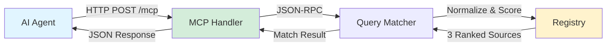

# 3 Good Sources (3GS)

**Curated, cryptographically-signed source recommendations for AI agents**

## What & Why

AI agents searching for resources often get SEO-gamed results, listicles stuffed with affiliate links, and content optimized for search engines instead of accuracy. When an agent needs to learn Rust, set up a Bitcoin node, or find privacy-focused home automation guides, traditional search returns hundreds of results with no quality signal.

**3GS solves this:** For each topic, a human curator researches and selects exactly three vetted sources — official documentation, practical tutorials, or essential tools. These recommendations are served via the Model Context Protocol (MCP) with cryptographic provenance using PKARR, so agents can verify the curator's identity and trust the recommendations.

The constraint is deliberate: **three sources per topic, always**. Quality over quantity. Primary sources over blog posts. Practical value over pagerank.

## Architecture



**Request flow:**
1. Agent sends natural language query via MCP tool call (e.g., "learn rust programming")
2. Query normalizer strips punctuation, removes stop words, lowercases text
3. Scorer runs fuzzy matching (normalized Levenshtein) against category patterns, slugs, and names
4. Keyword boosting increases score if query terms appear in category metadata
5. Threshold filter ensures only strong matches return (default: 0.4/1.0)
6. Best match returns category with all three sources, ranked and annotated

## Quickstart

**Prerequisites:**
- Rust 1.85+ (for edition 2024 support)
- cargo

**Run locally:**

```bash
git clone https://github.com/johnzilla/3goodsources.git
cd 3goodsources

# Configure (or use defaults from .env.example)
cp .env.example .env
# Edit .env if needed: REGISTRY_PATH=registry.json

cargo run
```

Server starts on `http://localhost:3000` by default.

**Test with curl:**

Initialize the MCP connection:

```bash
curl -X POST http://localhost:3000/mcp \
  -H "Content-Type: application/json" \
  -d '{
    "jsonrpc": "2.0",
    "id": 1,
    "method": "initialize",
    "params": {
      "protocolVersion": "2024-11-05",
      "capabilities": {},
      "clientInfo": {"name": "test-client", "version": "0.1.0"}
    }
  }'
```

Query for sources:

```bash
curl -X POST http://localhost:3000/mcp \
  -H "Content-Type: application/json" \
  -d '{
    "jsonrpc": "2.0",
    "id": 2,
    "method": "tools/call",
    "params": {
      "name": "get_sources",
      "arguments": {"query": "learn rust programming"}
    }
  }'
```

**Connect an MCP client:**

Add to your MCP client configuration (e.g., Claude Desktop):

```json
{
  "mcpServers": {
    "3gs": {
      "url": "http://localhost:3000/mcp"
    }
  }
}
```

The agent can now call 3GS tools to get curated sources for any topic.

## API Endpoints

### POST /mcp

**MCP JSON-RPC 2.0 endpoint.** Accepts initialize, tools/list, and tools/call requests.

Example request (get_sources tool):

```json
{
  "jsonrpc": "2.0",
  "id": 1,
  "method": "tools/call",
  "params": {
    "name": "get_sources",
    "arguments": {
      "query": "set up bitcoin node",
      "threshold": 0.4
    }
  }
}
```

Example response:

```json
{
  "jsonrpc": "2.0",
  "id": 1,
  "result": {
    "content": [{
      "type": "text",
      "text": "Category: Bitcoin Node Setup\nSlug: bitcoin-node-setup\n\nSources:\n\n1. Bitcoin Core Documentation\n   URL: https://bitcoin.org/en/full-node\n   Type: documentation\n   Why: Official guide from Bitcoin Core..."
    }],
    "isError": false
  }
}
```

### GET /health

Health check endpoint. Returns server status, version, and PKARR public key.

Example response:

```json
{
  "status": "ok",
  "version": "0.1.0",
  "pubkey": "ybnodffejre5yw6or85w9krbvww6omprf44yx1ytgjanej8k8uoy"
}
```

### GET /registry

Returns the full registry.json file for transparency. Agents or humans can inspect all categories, sources, and curator metadata.

Example response:

```json
{
  "version": "0.1.0",
  "updated": "2026-02-01",
  "curator": {
    "name": "3GS Curator",
    "pubkey": "pk:placeholder"
  },
  "categories": { ... }
}
```

## MCP Tools

### get_sources

**Find three curated sources for a topic.** Accepts natural language queries and returns the matching category with all three ranked sources.

**Parameters:**
- `query` (required, string): Natural language query describing what sources to find
  - Examples: "learn rust programming", "set up bitcoin node", "self-host email"
- `threshold` (optional, float 0.0-1.0): Match sensitivity. Lower values return more results, higher values require closer matches. Default: 0.4

**Returns:** Category name, description, and three sources (each with rank, name, URL, type, and explanation)

### list_categories

**List all available topics.** Returns category slugs, display names, and descriptions for all topics in the registry.

**Parameters:** None

**Returns:** Formatted list of all categories, sorted by slug

### get_provenance

**Get curator identity and verification info.** Returns curator name, PKARR public key, registry version, and instructions for cryptographic verification.

**Parameters:** None

**Returns:** Curator metadata and verification instructions

### get_endorsements

**Get curator endorsements.** Returns the list of other curators who endorse this registry. In v1, this always returns an empty list (feature scaffolded for future use).

**Parameters:** None

**Returns:** Endorsement list (empty in v1) with explanatory message

## Configuration

Configure via environment variables (loaded from `.env` if present):

| Variable             | Required | Default  | Description                                                              |
|----------------------|----------|----------|--------------------------------------------------------------------------|
| REGISTRY_PATH        | Yes      | —        | Path to registry.json file                                               |
| PORT                 | No       | 3000     | Server port                                                              |
| LOG_FORMAT           | No       | pretty   | Logging format: `pretty` (colored, dev) or `json` (structured, prod)     |
| PKARR_SECRET_KEY     | No       | —        | 64-char hex string (32 bytes) for persistent identity. Generates ephemeral keypair if not set |
| MATCH_THRESHOLD      | No       | 0.4      | Minimum match score (0.0-1.0) to return a result                         |
| MATCH_FUZZY_WEIGHT   | No       | 0.7      | Weight for fuzzy matching component (0.0-1.0)                            |
| MATCH_KEYWORD_WEIGHT | No       | 0.3      | Weight for keyword boosting component (0.0-1.0)                          |

## Registry Format

The registry.json file contains all curated sources, structured by category. Each category has:

- **name**: Human-readable category name
- **description**: What this topic covers
- **query_patterns**: Natural language queries users might ask
- **sources**: Exactly 3 sources, each with rank, name, URL, type, and explanation

Example category:

```json
{
  "bitcoin-node-setup": {
    "name": "Bitcoin Node Setup",
    "description": "Running a Bitcoin full node for network participation...",
    "query_patterns": [
      "how do I run a bitcoin full node",
      "setting up bitcoin core"
    ],
    "sources": [
      {
        "rank": 1,
        "name": "Bitcoin Core Documentation",
        "url": "https://bitcoin.org/en/full-node",
        "type": "documentation",
        "why": "Official guide from Bitcoin Core..."
      }
    ]
  }
}
```

For complete schema documentation, see [docs/SCHEMA.md](docs/SCHEMA.md).

## How It Works

**Query matching algorithm:**

1. **Normalization**: Query is lowercased, punctuation stripped, stop words removed, whitespace normalized
2. **Fuzzy matching**: Normalized query is compared against category patterns, slugs, and names using normalized Levenshtein distance
3. **Keyword boosting**: If query terms appear in category metadata, score is boosted
4. **Weighted combination**: Final score = (fuzzy_weight × fuzzy_score) + (keyword_weight × keyword_score)
5. **Threshold filtering**: Only matches above threshold (default 0.4) are returned

This ensures queries like "learn rust programming" match the `rust-learning` category, while queries like "run bitcoin node" match `bitcoin-node-setup`, even if the exact wording differs from stored patterns.

For full algorithm documentation and curation methodology, see [docs/METHODOLOGY.md](docs/METHODOLOGY.md).

## Verification

**Verify curator identity and source authenticity:**

**Step 1:** Get the server's public key:

```bash
curl http://localhost:3000/health
```

Look for the `pubkey` field (z-base-32 encoded PKARR public key).

**Step 2:** Call the get_provenance tool to get curator identity:

```bash
curl -X POST http://localhost:3000/mcp \
  -H "Content-Type: application/json" \
  -d '{
    "jsonrpc": "2.0",
    "id": 1,
    "method": "tools/call",
    "params": {"name": "get_provenance", "arguments": {}}
  }'
```

**Step 3:** Verify the public key matches. This proves:
- The server is running with the declared identity
- Responses come from the curator who signed the registry
- Source recommendations haven't been tampered with

For PKARR primer and future federation vision, see [docs/PUBKY.md](docs/PUBKY.md).

## Docker

**Build:**

```bash
docker build -t 3gs .
```

**Run:**

```bash
docker run -p 3000:3000 \
  -e REGISTRY_PATH=/app/registry.json \
  -e PKARR_SECRET_KEY=your-64-char-hex-key \
  3gs
```

The Dockerfile uses a multi-stage build (Rust 1.85 builder, debian:bookworm-slim runtime) optimized for production deployment.

Deployed on DigitalOcean App Platform. See `.do/app.yaml` for app spec.

## License

MIT

---

**Learn more:**
- Full registry schema: [docs/SCHEMA.md](docs/SCHEMA.md)
- Curation methodology & matching algorithm: [docs/METHODOLOGY.md](docs/METHODOLOGY.md)
- PKARR identity & federation vision: [docs/PUBKY.md](docs/PUBKY.md)
