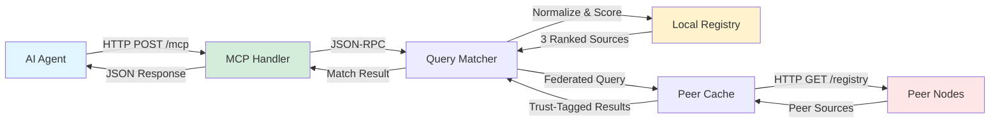

# 3 Good Sources (3GS)

**Federated, cryptographically-signed source recommendations for AI agents**

## What & Why

AI agents searching for resources often get SEO-gamed results, listicles stuffed with affiliate links, and content optimized for search engines instead of accuracy. When an agent needs to learn Rust, set up a Bitcoin node, or find privacy-focused home automation guides, traditional search returns hundreds of results with no quality signal.

**3GS solves this:** For each topic, a human curator researches and selects exactly three vetted sources. These recommendations are served via the Model Context Protocol (MCP) with cryptographic provenance using PKARR, so agents can verify the curator's identity and trust the recommendations.

**Federation:** Curators run their own 3GS nodes, endorse each other, and agents query across the trust network. Each node is opinionated (three sources per topic), but the network provides breadth. PGP's web of trust, but for source quality.

The constraint is deliberate: **three sources per topic, always**. Quality over quantity. Primary sources over blog posts. Practical value over pagerank.

## Architecture


```mermaid
graph LR
    A[AI Agent] -->|HTTP POST /mcp| B[MCP Handler]
    B -->|JSON-RPC| C[Query Matcher]
    C -->|Normalize & Score| D[Local Registry]
    C -->|Federated Query| E[Peer Cache]
    E -->|HTTP GET /registry| F[Peer Nodes]
    D -->|3 Ranked Sources| C
    F -->|Peer Sources| E
    E -->|Trust-Tagged Results| C
    C -->|Match Result| B
    B -->|JSON Response| A

    style A fill:#e1f5ff
    style D fill:#fff3cd
    style B fill:#d4edda
    style F fill:#ffe6e6
```

**Request flow (local):**
1. Agent sends natural language query via MCP tool call (e.g., "learn rust programming")
2. Query normalizer strips punctuation, removes stop words, lowercases text
3. Scorer runs fuzzy matching (normalized Levenshtein) against category patterns, slugs, and names
4. Keyword boosting increases score if query terms appear in category metadata
5. Threshold filter ensures only strong matches return (default: 0.4/1.0)
6. Best match returns category with all three sources, ranked and annotated

**Request flow (federated):**
1. Same matching runs on local registry (results tagged `trust: direct`)
2. Matching also runs on cached peer registries (results tagged `trust: endorsed`)
3. Agent sees sources from all trusted curators, knows who recommended what

## Quickstart

**Prerequisites:**
- Rust 1.85+ (for edition 2024 support)
- cargo

**Run locally:**

```bash
git clone https://github.com/johnzilla/3goodsources.git
cd 3goodsources

# Configure (or use defaults from .env.example)
cp .env.example .env
# Edit .env if needed: REGISTRY_PATH=registry.json

cargo run
```

Server starts on `http://localhost:3000` by default.

**Run from Docker:**

```bash
docker pull ghcr.io/johnzilla/3goodsources:latest
docker run -p 3000:3000 ghcr.io/johnzilla/3goodsources:latest
```

**Fork a new node:**

Scaffold your own 3GS node that endorses an existing curator:

```bash
cargo run -- fork --endorse <curator-pubkey> --url <curator-url> --name "Your Name"
```

This generates a new directory with a fresh PKARR keypair, skeleton registry, and `.env` file. Add your own categories and run it.

**Test with curl:**

Initialize the MCP connection:

```bash
curl -X POST http://localhost:3000/mcp \
  -H "Content-Type: application/json" \
  -d '{
    "jsonrpc": "2.0",
    "id": 1,
    "method": "initialize",
    "params": {
      "protocolVersion": "2024-11-05",
      "capabilities": {},
      "clientInfo": {"name": "test-client", "version": "0.1.0"}
    }
  }'
```

Query for sources:

```bash
curl -X POST http://localhost:3000/mcp \
  -H "Content-Type: application/json" \
  -d '{
    "jsonrpc": "2.0",
    "id": 2,
    "method": "tools/call",
    "params": {
      "name": "get_sources",
      "arguments": {"query": "learn rust programming"}
    }
  }'
```

**Connect an MCP client:**

Add to your MCP client configuration (e.g., Claude Desktop):

```json
{
  "mcpServers": {
    "3gs": {
      "url": "http://localhost:3000/mcp"
    }
  }
}
```

The agent can now call 3GS tools to get curated sources for any topic.

## API Endpoints

### POST /mcp

**MCP JSON-RPC 2.0 endpoint.** Accepts initialize, tools/list, and tools/call requests. Serves 9 tools including source queries, federation, identity, audit, and community contributions.

### GET /health

Health check endpoint. Returns server status, version, and PKARR public key.

### GET /registry

Returns the full registry.json for transparency, including endorsements.

### GET /audit

Returns the signed, hash-chained audit log. Supports `since`, `category`, and `action` query filters.

### GET /identities

Returns all registered identities (PKARR-linked platform handles).

### GET /identities/{pubkey}

Returns a single identity by PKARR public key.

### GET /proposals

Lists community contribution proposals. Supports `status` and `category` filters.

### GET /proposals/{id}

Returns full proposal detail by UUID, including votes.

## MCP Tools

### get_sources

**Find three curated sources for a topic.** Accepts natural language queries and returns the matching category with all three ranked sources.

**Parameters:**
- `query` (required, string): Natural language query describing what sources to find
- `threshold` (optional, float 0.0-1.0): Match sensitivity. Default: 0.4

**Returns:** Category name, description, and three sources (each with rank, name, URL, type, and explanation)

### get_federated_sources

**Query sources across the federated network.** Same parameters as `get_sources`, but searches both the local registry and all endorsed peer registries. Results are tagged with trust level (`direct` for local, `endorsed` for peer) and curator identity.

**Parameters:**
- `query` (required, string): Natural language query
- `threshold` (optional, float 0.0-1.0): Match sensitivity. Default: 0.4

**Returns:** Sources from local + peer registries, each tagged with curator name, pubkey, trust level, and stale flag

### list_categories

**List all available topics.** Returns category slugs, display names, and descriptions for all topics in the registry.

### get_provenance

**Get curator identity and verification info.** Returns curator name, PKARR public key, registry version, and instructions for cryptographic verification.

### get_endorsements

**Get curator endorsements.** Returns the list of endorsed curators with their pubkeys, URLs, display names, and endorsement dates.

### get_audit_log

**Get the public audit log.** Returns signed, hash-chained entries showing registry changes. Supports `since`, `category`, and `action` filters.

### get_identity

**Look up an identity by PKARR public key.** Returns display name, type (human/bot), linked platform handles with proof URLs.

### list_proposals

**List community contribution proposals.** Supports `status` and `category` filters.

### get_proposal

**Get full proposal detail by UUID.** Includes all votes with voter pubkeys and timestamps.

## Configuration

Configure via environment variables (loaded from `.env` if present):

| Variable             | Required | Default  | Description                                                              |
|----------------------|----------|----------|--------------------------------------------------------------------------|
| REGISTRY_PATH        | Yes      | ---        | Path to registry.json file                                               |
| AUDIT_LOG_PATH       | Yes      | ---        | Path to audit_log.json file                                              |
| IDENTITIES_PATH      | Yes      | ---        | Path to identities.json file                                             |
| CONTRIBUTIONS_PATH   | Yes      | ---        | Path to contributions.json file                                          |
| PORT                 | No       | 3000     | Server port                                                              |
| LOG_FORMAT           | No       | pretty   | Logging format: `pretty` (colored, dev) or `json` (structured, prod)     |
| PKARR_SECRET_KEY     | No       | ---        | 64-char hex string (32 bytes) for persistent identity. Generates ephemeral keypair if not set |
| MATCH_THRESHOLD      | No       | 0.4      | Minimum match score (0.0-1.0) to return a result                         |
| MATCH_FUZZY_WEIGHT   | No       | 0.7      | Weight for fuzzy matching component (0.0-1.0)                            |
| MATCH_KEYWORD_WEIGHT | No       | 0.3      | Weight for keyword boosting component (0.0-1.0)                          |

## Federation

3GS nodes form a web of trust through endorsements. Each node runs independently with its own curator identity (PKARR keypair) and curated sources.

**How it works:**
1. Curator A endorses Curator B by adding B's pubkey and URL to their registry's endorsements
2. Node A fetches and caches B's registry in the background (every 5 minutes)
3. When an agent queries `get_federated_sources`, it searches both A's local registry and B's cached registry
4. Results are tagged with trust level: `direct` (local) or `endorsed` (peer)
5. If B is unreachable, A serves stale cached data with a flag, or skips B entirely

**Start your own node:**

```bash
cargo run -- fork --endorse <curator-pubkey> --url <curator-url>
```

**Endorsement format in registry.json:**

```json
{
  "endorsements": [
    {
      "pubkey": "ybnodffejre5yw6or85w9krbvww6omprf44yx1ytgjanej8k8uoy",
      "url": "https://peer.example.com",
      "name": "Peer Curator",
      "since": "2026-04-03"
    }
  ]
}
```

## Registry Format

The registry.json file contains all curated sources, structured by category. Each category has:

- **name**: Human-readable category name
- **description**: What this topic covers
- **query_patterns**: Natural language queries users might ask
- **sources**: Exactly 3 sources, each with rank, name, URL, type, and explanation

Example category:

```json
{
  "bitcoin-node-setup": {
    "name": "Bitcoin Node Setup",
    "description": "Running a Bitcoin full node for network participation...",
    "query_patterns": [
      "how do I run a bitcoin full node",
      "setting up bitcoin core"
    ],
    "sources": [
      {
        "rank": 1,
        "name": "Bitcoin Core Documentation",
        "url": "https://bitcoin.org/en/full-node",
        "type": "documentation",
        "why": "Official guide from Bitcoin Core..."
      }
    ]
  }
}
```

For complete schema documentation, see [docs/SCHEMA.md](docs/SCHEMA.md).

## How It Works

**Query matching algorithm:**

1. **Normalization**: Query is lowercased, punctuation stripped, stop words removed, whitespace normalized
2. **Fuzzy matching**: Normalized query is compared against category patterns, slugs, and names using normalized Levenshtein distance
3. **Keyword boosting**: If query terms appear in category metadata, score is boosted
4. **Weighted combination**: Final score = (fuzzy_weight x fuzzy_score) + (keyword_weight x keyword_score)
5. **Threshold filtering**: Only matches above threshold (default 0.4) are returned

This ensures queries like "learn rust programming" match the `rust-learning` category, while queries like "run bitcoin node" match `bitcoin-node-setup`, even if the exact wording differs from stored patterns.

For full algorithm documentation and curation methodology, see [docs/METHODOLOGY.md](docs/METHODOLOGY.md).

## Verification

**Verify curator identity and source authenticity:**

**Step 1:** Get the server's public key:

```bash
curl http://localhost:3000/health
```

Look for the `pubkey` field (z-base-32 encoded PKARR public key).

**Step 2:** Call the get_provenance tool to get curator identity:

```bash
curl -X POST http://localhost:3000/mcp \
  -H "Content-Type: application/json" \
  -d '{
    "jsonrpc": "2.0",
    "id": 1,
    "method": "tools/call",
    "params": {"name": "get_provenance", "arguments": {}}
  }'
```

**Step 3:** Verify the public key matches. This proves:
- The server is running with the declared identity
- Responses come from the curator who signed the registry
- Source recommendations haven't been tampered with

For PKARR primer and federation details, see [docs/PUBKY.md](docs/PUBKY.md).

## Docker

**Pull from GHCR:**

```bash
docker pull ghcr.io/johnzilla/3goodsources:latest
docker run -p 3000:3000 ghcr.io/johnzilla/3goodsources:latest
```

**Build locally:**

```bash
docker build -t 3gs .
docker run -p 3000:3000 \
  -e REGISTRY_PATH=/app/registry.json \
  -e PKARR_SECRET_KEY=your-64-char-hex-key \
  3gs
```

**Publish to GHCR:**

```bash
./scripts/docker-publish.sh          # pushes :latest + :sha-<hash>
./scripts/docker-publish.sh v3.0     # also pushes :v3.0
```

The Dockerfile uses a multi-stage build (Rust 1.85 builder, debian:bookworm-slim runtime) optimized for production deployment.

Deployed on DigitalOcean App Platform. See `.do/app.yaml` for app spec.

## License

MIT

---

**Learn more:**
- Full registry schema: [docs/SCHEMA.md](docs/SCHEMA.md)
- Curation methodology & matching algorithm: [docs/METHODOLOGY.md](docs/METHODOLOGY.md)
- PKARR identity & federation: [docs/PUBKY.md](docs/PUBKY.md)
